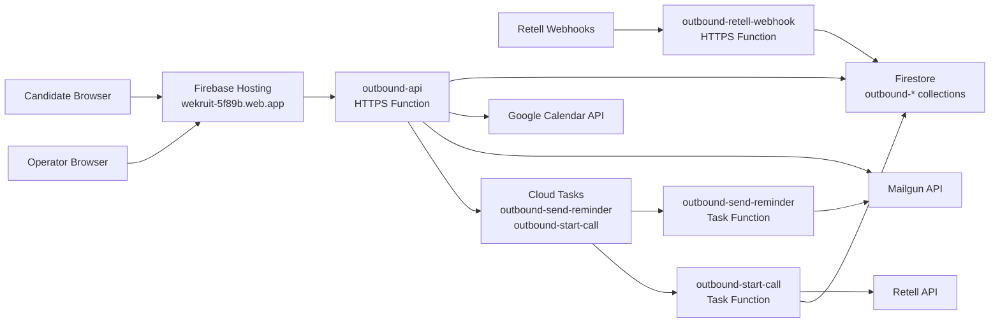

# WeKruit Core Service Cloud Function Architecture

`wekruit-core-service-cloud-function` is the Firebase-native backend for WeKruit services.

Current live service scope:

- `outbound`

Current production Firebase project:

- `wekruit-5f89b`

Current staging Firebase project:

- `wekruit-dev-env`

## System Overview

## Boundary

Frontend and backend are intentionally split:

- frontend repo: `wekruit-outbound`
- backend repo: `wekruit-core-service-cloud-function`

The frontend is responsible for:

- candidate pages
- operator pages
- client-side state
- Firebase Hosting deploy

The backend is responsible for:

- dispatch profile management
- invite wave creation
- public booking APIs
- invite token booking APIs
- Google Calendar free/busy and event creation
- Mailgun invite, confirmation, and reminder delivery
- Retell outbound call dispatch
- Retell webhook persistence
- task scheduling through Cloud Tasks

## Firebase Resources

All outbound resources use the `outbound-*` prefix.

### Functions

- `outbound-api`
- `outbound-retell-webhook`
- `outbound-send-reminder`
- `outbound-start-call`

### Firestore collections

- `outbound-candidates`
- `outbound-dispatch-profiles`
- `outbound-scheduling-invites`
- `outbound-bookings`
- `outbound-call-artifacts`

### Task queues

- `outbound-send-reminder`
- `outbound-start-call`

### Secret Manager

- `OUTBOUND_ADMIN_API_KEY`
- `OUTBOUND_RETELL_API_KEY`
- `OUTBOUND_MAILGUN_API_KEY`
- `OUTBOUND_MAILGUN_DOMAIN`
- `OUTBOUND_MAILGUN_FROM_EMAIL`
- `OUTBOUND_GOOGLE_SERVICE_ACCOUNT_EMAIL`
- `OUTBOUND_GOOGLE_SERVICE_ACCOUNT_PRIVATE_KEY`
- `OUTBOUND_APP_BASE_URL`

## Request Flow

### Public booking

1. Candidate opens Firebase Hosting.
2. Hosting rewrites `/api/**` to `outbound-api`.
3. `outbound-api` reads active public dispatch profiles from Firestore.
4. Candidate chooses a route and slot.
5. `outbound-api` creates a Google Calendar event.
6. `outbound-api` writes the booking to `outbound-bookings`.
7. `outbound-api` sends booking confirmation through Mailgun.
8. `outbound-api` schedules:
   - `outbound-send-reminder`
   - `outbound-start-call`

### Invite booking

1. Operator creates a scheduling invite through `outbound-api`.
2. Invite record is written to `outbound-scheduling-invites`.
3. Mailgun sends the invite link.
4. Candidate opens `/invite/:token`.
5. The same booking flow completes against the pre-routed dispatch profile.

### Scheduled call

1. `outbound-start-call` runs at the booking time.
2. It reads the booking snapshot from Firestore.
3. It calls Retell with:
   - `retellAgentId`
   - `retellFromPhoneNumber`
   - candidate metadata
4. Retell returns `call_id`.
5. The booking is updated with `retellCallId`.
6. Retell later posts webhook events to `outbound-retell-webhook`.
7. Webhook data is persisted into `outbound-call-artifacts`.

## Data Model Principles

The backend preserves snapshot integrity:

- bookings store candidate snapshot fields
- invites store candidate snapshot fields
- bookings store route snapshot fields

This prevents later candidate edits from mutating historical booking or invite records.

## Deployment Model

### Production

- Firebase project: `wekruit-5f89b`
- Hosting: `wekruit-5f89b.web.app`
- Functions region: `us-central1`

### Staging

- Firebase project: `wekruit-dev-env`
- Functions region: `us-central1`

## Custom Domain

This stack can serve `outbound.wekruit.com`, but only after Firebase Hosting custom domain setup is completed:

1. Add the custom domain in Firebase Hosting.
2. Create the DNS records Firebase gives back.
3. Wait for certificate provisioning.
4. Point the production frontend domain at Hosting.

Without those DNS records, the live Firebase endpoint remains the `web.app` domain.
