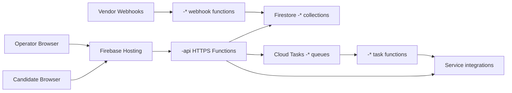

# WeKruit Core Service Cloud Function Architecture

`wekruit-core-service-cloud-function` is the Firebase-native backend monorepo for WeKruit core services.

It is designed to host multiple services, not just `outbound`.

Current live service scope:

- `outbound`
- `sourcing`
- `matching` (implemented in repo, pending deploy)

Current Firebase projects:

- staging: `wekruit-dev-env`
- production: `wekruit-5f89b`

## System Overview



## Repo Boundary

The system is intentionally split:

- frontend repo: `wekruit-outbound`
- backend repo: `wekruit-core-service-cloud-function`

The frontend owns:

- candidate-facing pages
- operator-facing pages
- client-side state
- Firebase Hosting deploy

The backend owns:

- service APIs
- Firestore persistence
- Cloud Task scheduling
- third-party integrations
- vendor webhook ingestion

## Monorepo Rule

This repo is a **service container**, not a single-product codebase.

Every service added here must:

1. live under `src/services/<service-name>`
2. own its own prefixed collections
3. own its own prefixed functions
4. own its own prefixed task queues
5. declare its own params/secrets in `src/bootstrap/secrets.ts`
6. export its runtime from `src/index.ts`

If those conditions are not true, the service is not correctly integrated.

## Code Layout

```text
src/
  bootstrap/
    firebase.ts
    secrets.ts
  shared/
    firestore/
    http/
    tasks/
    time/
    validation/
  services/
    outbound/
      application/
      domain/
      repositories/
      integrations/
      functions/
        http/
        tasks/
    sourcing/
      application/
      domain/
      repositories/
      functions/
        http/
    matching/
      application/
      domain/
      repositories/
      integrations/
      functions/
        http/
```

### Layer meanings

- `bootstrap/`: Firebase admin and repo-wide runtime params
- `shared/`: primitives reused across services
- `application/`: service orchestration
- `domain/`: service invariants and record contracts
- `repositories/`: Firestore access
- `integrations/`: Google/Mailgun/Retell/etc
- `functions/http/`: HTTPS entrypoints
- `functions/tasks/`: task handlers

## Resource Naming Contract

For any service named `<service-name>`:

- Functions: `<service-name>-*`
- Firestore collections: `<service-name>-*`
- Cloud Tasks queues: `<service-name>-*`
- params/secrets: `<SERVICE_NAME_UPPER>_*`

### Current outbound resources

#### Functions

- `outbound-api`
- `outbound-retell-webhook`
- `outbound-send-reminder`
- `outbound-start-call`

#### Firestore collections

- `outbound-candidates`
- `outbound-dispatch-profiles`
- `outbound-scheduling-invites`
- `outbound-bookings`
- `outbound-call-artifacts`

#### Cloud Tasks queues

- `outbound-send-reminder`
- `outbound-start-call`

#### Secrets and params

- `OUTBOUND_ADMIN_API_KEY`
- `OUTBOUND_RETELL_API_KEY`
- `OUTBOUND_MAILGUN_API_KEY`
- `OUTBOUND_MAILGUN_DOMAIN`
- `OUTBOUND_MAILGUN_FROM_EMAIL`
- `OUTBOUND_GOOGLE_SERVICE_ACCOUNT_EMAIL`
- `OUTBOUND_GOOGLE_SERVICE_ACCOUNT_PRIVATE_KEY`
- `OUTBOUND_APP_BASE_URL`
- `OUTBOUND_APP_TIMEZONE`
- `OUTBOUND_BOOKING_SLOT_MINUTES`
- `OUTBOUND_BOOKING_HORIZON_DAYS`
- `OUTBOUND_BOOKING_WORKDAY_START_HOUR`
- `OUTBOUND_BOOKING_WORKDAY_END_HOUR`
- `OUTBOUND_BOOKING_LEAD_HOURS`
- `OUTBOUND_BOOKING_REMINDER_HOURS`

### Current sourcing resources

#### Functions

- `sourcing-api`

#### Firestore collections

- `sourcing-source-runs`
- `sourcing-source-records`
- `sourcing-evidence`
- `sourcing-dedup-candidates`
- `sourcing-review-labels`
- `sourcing-approved-entities`

#### Hosting rewrite

- `/api/sourcing/**` -> `sourcing-api`

#### Cloud Tasks queues

- `sourcing-materialize-approved-entity`

### Current matching resources

#### Functions

- `matching-api`

#### Firestore collections

- `platform-users`
- `matching-jobs`
- `matching-feedback`
- `matching-saved-jobs`

#### Secrets and params

- `MATCHING_SYNC_API_KEY`
- `MATCHING_SUPABASE_URL`
- `MATCHING_SUPABASE_SERVICE_ROLE_KEY`
- `MATCHING_OPENAI_API_KEY`

## Runtime Export Model

`src/index.ts` is the repo-level runtime registry.

Current shape:

```ts
export = {
  outbound: {
    api: outboundApi,
    retell: {
      webhook: outboundRetellWebhook,
    },
    send: {
      reminder: outboundSendReminder,
    },
    start: {
      call: outboundStartCall,
    },
  },
  sourcing: {
    api: sourcingApi,
  },
  matching: {
    api: matchingApi,
  },
};
```

Each service must appear as a top-level key.

`CORE_SERVICE_EXPORT_MODE` can limit exports during isolated deploys:

- `sourcing` exports only `sourcing-api`
- `outbound` exports only outbound functions
- unset exports all services

## Matching Service Flow

### User sync

1. Supabase Database Webhook posts `INSERT` or `UPDATE` events for VALET `users` rows to `matching-api`.
2. `matching-api` validates the `X-Webhook-Signature` header.
3. The service loads the full VALET aggregate from Supabase (`users`, `user_application_profiles`, `resumes`).
4. The aggregate is mapped into `platform-users/{uid}` and deduplicated by payload hash.

### Job sync

1. The Mac Mini pipeline posts batched payloads to `POST /api/sync/jobs`.
2. `matching-api` validates the `X-API-Key` header.
3. The service upserts only jobs whose `content_hash` or `status` changed.
4. Inactive jobs stay in Firestore with `status = inactive`; they are never deleted by sync.

### Matching and job board

1. Callers request matches through `POST /api/matching/matches`.
2. The service loads the caller's `platform-users` profile plus stored feedback history.
3. Firestore equality and array filters reduce candidates before cosine scoring runs in memory.
4. The 7-signal scorer ranks the filtered jobs.
5. `GET /api/matching/jobs` and `GET /api/matching/jobs/:jobId` expose the same Firestore corpus for browsing.

## Outbound Service Flow

### Public booking

1. Candidate opens Firebase Hosting.
2. Hosting rewrites `/api/**` to `outbound-api`.
3. `outbound-api` reads active public dispatch profiles from Firestore.
4. Candidate chooses a route and slot.
5. `outbound-api` creates a Google Calendar event.
6. `outbound-api` writes the booking to `outbound-bookings`.
7. `outbound-api` sends booking confirmation through Mailgun.
8. `outbound-api` schedules:
   - `outbound-send-reminder`
   - `outbound-start-call`

### Invite booking

1. Operator creates a scheduling invite through `outbound-api`.
2. Invite record is written to `outbound-scheduling-invites`.
3. Mailgun sends the invite link.
4. Candidate opens `/invite/:token`.
5. The same booking flow completes against the pre-routed dispatch profile.

### Scheduled call

1. `outbound-start-call` runs at booking time.
2. It reads the booking snapshot from Firestore.
3. It calls Retell with:
   - `retellAgentId`
   - `retellFromPhoneNumber`
   - candidate metadata
4. Retell returns `call_id`.
5. The booking is updated with `retellCallId`.
6. Retell later posts webhook events to `outbound-retell-webhook`.
7. Webhook data is persisted into `outbound-call-artifacts`.

## Sourcing Service Flow

1. A local scraping worker converts source-specific JSONL into generic source records.
2. The worker creates a `sourcing-source-runs` record through `POST /api/sourcing/source-runs`.
3. The worker uploads batches through `POST /api/sourcing/source-records:batchUpsert`.
4. `sourcing-api` stores `sourcing-source-records` and extracts `sourcing-fact-evidence`.
5. Exact identity evidence such as email, ORCID, GitHub, DBLP, OpenReview, Google Scholar, or homepage creates `sourcing-dedup-candidates`.
6. An operator reviews each candidate in the static Hosting console and submits a `sourcing-review-labels` decision.
7. A `same_person` decision materializes a `sourcing-approved-entities` record for later outbound use.

## Data Model Principles

Every service should follow the same persistence rule:

- historical records must store snapshots
- later edits must not mutate history
- task execution must read immutable execution inputs

`outbound` already follows this:

- bookings store candidate snapshot fields
- invites store candidate snapshot fields
- bookings store route snapshot fields

## Deployment Model

### Production

- Firebase project: `wekruit-5f89b`
- frontend Hosting site: `wekruit-outbound`
- frontend URL: [https://wekruit-outbound.web.app](https://wekruit-outbound.web.app)
- Functions region: `us-central1`

### Staging

- Firebase project: `wekruit-dev-env`
- frontend Hosting site: `wekruit-outbound-staging`
- frontend URL: [https://wekruit-outbound-staging.web.app](https://wekruit-outbound-staging.web.app)
- Functions region: `us-central1`

## Custom Domain Status

Firebase Hosting already has a custom-domain mapping created for:

- `outbound.wekruit.com`

Current Firebase state:

- host state: `HOST_UNHOSTED`
- ownership state: `OWNERSHIP_MISSING`
- cert state: `CERT_PREPARING`

Required DNS update:

- `CNAME outbound -> wekruit-outbound.web.app`

Once that DNS record is added at your provider and any conflicting record is removed, Firebase will complete domain ownership and certificate provisioning.

## How The Next Service Fits

If the next service is, for example, `screening`, the architecture does not change.

Only these things are added:

1. `src/services/screening/*`
2. `screening-*` Firestore collections
3. `screening-*` Functions
4. `screening-*` Task queues
5. `SCREENING_*` params and secrets
6. a new top-level `screening` export in `src/index.ts`

That is the intended scale path for this repo.
